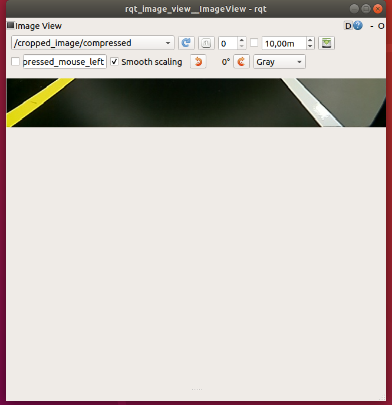

<p align="center">  
   
</p >

# <p align="center">University of Burgundy
</p > 

# <p align="center">Master of Computer vision and Robotics</p >   
<p align="center">  
   
</p >

# <p align="center">Robotics Project</p> 

## <p align="center">Supervisors:</p > 
<p align="center"> Ralph SEULIN</p >   
<p align="center"> David FOFI </p >   
<p align="center"> Raphael DUVERNE </p >   
<p align="center"> Renato MARTINS </p >   
<p align="center"> Joaquin RODRIGUEZ </p >   

## <p align="center">Students:</p >

<p align="center">Shriarulmozhivarman GOBICHETTIPALAYAM</p>
<p align="center">Etinosa Matthew IKPONMWOSA</p>


## Table of contents:
- [Aim of the Project](#aim-of-the-project)
- [Introduction](#introduction)
- [Prior Knowledge](#prior-knowledge)
- [Tasks](#tasks)
- [Implementation](#Implementation)
   - [Image Calibration](#Image-Calibration-1)
   - [HSV Filtering](#HSV-Filtering-1)
   - [Cropping the Image](#Cropping-the-Image-1)
   - [Control](#Control-1)
- [Setup to run the package](#Setup-to-run-the-package)
- [Conclusions](#Conclusions)
- [References](#References)


## Aim of the Project

The Aim of this project is to Demonstrate a Ground Robot (in our case its the [turtlebot3 burger](https://emanual.robotis.com/docs/en/platform/turtlebot3/overview/) from [Robotis](https://emanual.robotis.com/))
performing Autonomous Driving by Perception (perform Lane Detection and Autonomus Driving of the robot).The project has to done with the [ROS Melodic](http://wiki.ros.org/melodic).

## Introduction

The Robot Operating System (ROS) is an open-source robotics middleware suite and a framework for robot software development, providing operating system-like functionality.ROS provides standard operating system services such as hardware abstraction, low-level device control, implementation of commonly-used functionality, message-passing between processes, and package management.

TurtleBot3(Burger) is a programmable ROS-based mobile robot used in research and education.The turtlebot3 burger has the sensor such as a [360 Laser Distance Sensor](https://emanual.robotis.com/docs/en/platform/turtlebot3/appendix_lds_01/) and a [Raspberry Pi Camera Module](https://www.raspberrypi.com/products/camera-module-v2/), control borads such as [OpenCR1.0](https://emanual.robotis.com/docs/en/platform/turtlebot3/appendix_opencr1_0/) (for low level control) and a Single Board Computer  [Raspberry Pi 3B+](https://www.raspberrypi.com/products/raspberry-pi-3-model-b-plus/)(for high level control and running ros Nodes).


**Autonomous Driving by Perception** with the turtlebot3 burger on the [autorace](https://emanual.robotis.com/docs/en/platform/turtlebot3/autonomous_driving_autorace/) track can be done with the camera. The image caputred from the camera has to be processed by the Remote PC and make the robot autonomous Drive through the auto race track.


## Prior Knowledge
The lane has to follow the lanes with ***yellow*** on the left and ***white*** on the right and the distance between the lane remains constant throught out the track(even in turns and in the tunnel).

<p align="center
">  
   
   

</p >

The has to autonomous drive in between the lane with this prior knowledge.

## Tasks
- #### Image Calibration 

The Image from the raspicam has to be calibrated, so the image obtained will be contrast, sharper image of the lanes for us to filter using the HSV color space.

<p align="center
">
  
</p>

- #### HSV Filtering

The Image must be filted to get the ***yellow*** and ***white*** lane in the image. The filtering can be done in the HSV color Space rather than the RGB color Space because the color can be seperated in variations in the image color values due to various lightening conditions, shadows in HSV color spaceeasily.


<p align="center
">
  
</p>

- #### Cropping the Image

The whole image from the image is too large to process and the we do no need the whole image to navigate, so the image has to cropped to right infornt of the robot to naviaget the track autonomously. 


<p align="center
">
  
</p>

- #### Control

The robot must maintain in the ***middle*** of the track to navigate the track. By cropping and filtering the whole image, we can estimate the pose of the robot with respect to the track from the image, with this pose and image we can get the error in the position of the robot in the image and apply velocity commands according to the error from the image.Detect the lines and control the robot with the a PID contorl.

<p align="center
">
  
</p>


<p align="center
">
 
</p>

## Implementation

For all the implementaton steps the following launch of files are to runned in the terminal.</br>
launch roscore on the *Remote PC*.
```
$ roscore
```
launch the turtlebot3 bringup in the Single Borad Computer(*SBC*) this strats the turtlebot3_core Node and starts publishing,subscribing the information between the SBC and sensor,actuators. 
```
$ roslaunch turtlebot3_bringup turtlebot3_robot.launch
```

launch the turtlebot3 rpicamera Node to start the camera to capturing the images on the *SBC*:
```
$ roslaunch turtlebot3_bringup turtlebot3_rpicamera.launch 
```
- ### Image Calibration

Start the rqt_reconfigurer on the *Remote PC* to calibrate the image:

```
$ rosrun rqt_reconfigure rqt_reconfigure
```
select the *raspicam_node* to cahnge the parameters.

Once the image is in good contrast, sharper the parameter can be save in a **yaml** file to used in the next step and kill the node.

- ### HSV Filtering 

With the parameters from image calibration, these parametes has to set to the image by running the rosnode on the *Remote PC* with the command below and start the hsv_detector node on the *Remote PC* .
```
$ rosrun turtlebot3_autorace_lane reconfigure_camera.py
$ rosrun turtlebot3_autorace_lane hsv_detector.py
```
[**hsv_detector.py**](turtlebot3_autorace_lane/src/hsv_detector.py) is a implementation in python and opencv to filter the images with the desired color. It does this is by subscribing the topic **/raspicam_node/image/compressed** and convert the *sensor_msgs/Image* to opencv HSV Image and applies the filtering values from the trackbar to the filter the image. 

Once the values for noted to be entered in [config file](turtlebot3_autorace_lane/config/config.yaml) and Kill the node.

- ### Cropping the Image
The image from the camera is of size size 480 x 640, but this is too big to process in real time control, so we can crop the image so that image is smaller that is easy to process. The cropped image has to be right infront of the robot,so the robot can use this image to naviate the track.
enter dynamic_reconfigurethe follwoing command on the *Remote PC*
```dyndynamic_reconfigureamic_reconfigure
$ rosrun turtlebot3_autorace_lane image_resize_parameter.py
```
[**image_resize_parameter.py**](turtlebot3_autorace_lane/src/image_resize_parameter.py) is a implementation in python with the ros dynamic reconfigure server to configure the image coordinate to be cropped. It does this is by subscribing the topic **/raspicam_node/image/compressed** and convert the *sensor_msgs/Image* to opencv image, and then lines to drawn on the image to reflect the region to be cropped later.The parameters are to update in the [config file](turtlebot3_autorace_lane/config/config.yaml). I tried to use the homography to get the image infront of the robot,but computing homography is time consuming and is not real-time for this image size on the robot.

- ### Control
The Robot's velocity can be controlled by publishing to **/cmd_vel** topic.
[**line_moment.py**](turtlebot3_autorace_lane/src/line_moment.py) is a implementation in python and opencv to filter image and find the centroid lanes to maintain in the middle of the track. It subscribes to  the topic **/raspicam_node/image/compressed** and crops with the image coordinates set in the [config file](turtlebot3_autorace_lane/config/config.yaml) and applies the filter on the image to obtain the mask for yellow and white color in the cropped image, with these masked image. When in situations the robot sees one of the lines in the track, or when there are less than 35 pixels of a particular color in the mask, in these cases we use a mask of the color that were pre recorded.The moment are computed for the mask, and publish the centroid of the lane for the robot in the topic **/control_lane**.</br>


https://user-images.githubusercontent.com/42157171/145550785-83187410-1b12-4829-bf10-055185fd8b05.mp4

The video above is captured of the mask of White lines in the lane from the cropped image.

https://user-images.githubusercontent.com/42157171/145550804-7f8f7c02-d250-484c-9318-b039c229acc5.mp4

The video above is captured of the mask of Yellow lines in the lane from the cropped image.

https://user-images.githubusercontent.com/42157171/145550673-15ff7b39-9637-4fd0-a33b-02d376b86c82.mp4

The video above is captured of the control with the lane the blue circle is the centrioid of the moments of both the lines.green is the moment of the white line and red is the moment of the red line.


[**control_lane**](turtlebot3_autorace_lane/src/control_lane.py) subscribes to the topic **/control_lane** and computes the error and apply a PID control on the velocity of the robot to control it.

## Setup to run the package
## Conclusions
## References
